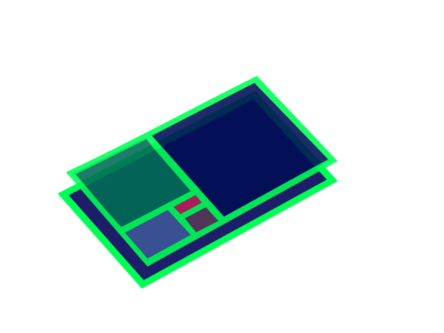

# BuildOnTitanX

## Some WIP stuff

- pnpm eslint src/ # (The Update eslint for 9 is done, but no details are defined)
- pnpm astro check # (Goes into proper details about eg. the components)

| Command           | Action                                       |
| :---------------- | :------------------------------------------- |
| `pnpm install`     | Installs dependencies                        |
| `pnpm run dev`     | Starts local dev server at `localhost:4321`  |
| `pnpm run build`   | Build your production site to `./dist/`      |
| `pnpm run preview` | Preview your build locally, before deploying |
